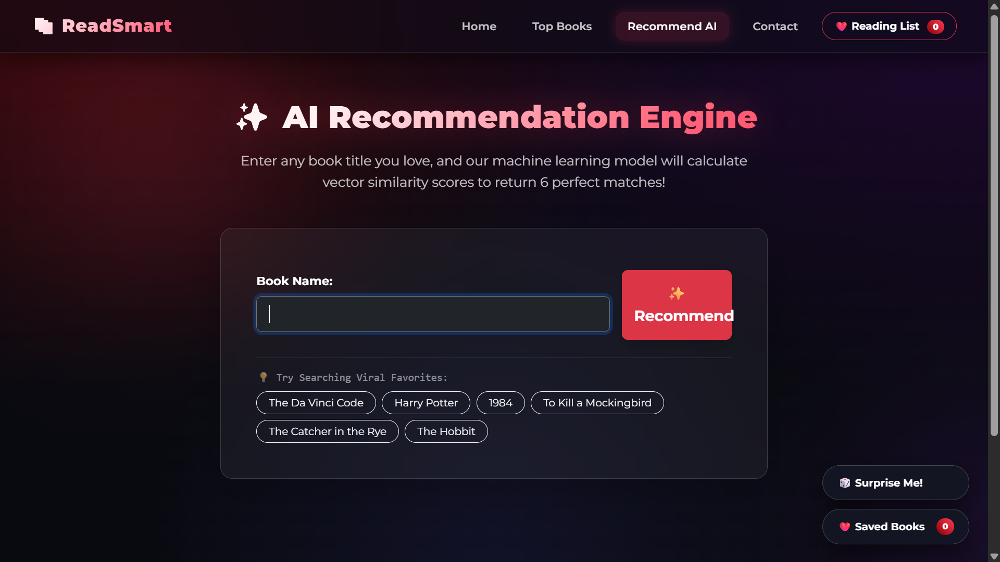

# 📚 READSMART — Book Recommender System 

A machine learning-powered **Book Recommendation Web Application** built using **Flask**, **NumPy**, and **Pickle-based Collaborative Filtering Models**.

*READSMART* helps users discover books through popularity rankings and personalized recommendations using similarity-based machine learning.

---

### Note - 
<b>This project uses pre-trained pickle files for the recommendation model.</b>
<b>Clone the repository and run the application using the provided instructions.</b>

---
## ✨ Features

### 📖 Popular Books Homepage
Displays trending/popular books with:

- Book title
- Author name
- Book cover image
- Total number of ratings
- Average rating

---

### 🤖 Personalized Book Recommendations-
Users can search for a book and receive ***Top 5 similar book recommendations***.

Recommendation logic includes:

- Collaborative Filtering
- Precomputed Similarity Matrix
- Pivot Table Index Matching
- NumPy-based Sorting

---

### 🔍 Real-Time Search Suggestions
Autocomplete recommendations appear as users type.

**Example:**

Typing:

```bash
Harry
```

May suggest:

- Harry Potter and the Sorcerer's Stone
- Harry Potter and the Chamber of Secrets
- Harry Potter and the Prisoner of Azkaban

---

### 📩 Contact Form
Users can send feedback or messages directly through the website.

Messages are stored locally in:

```bash
messages.txt
```

---

### ⚠ Error Handling
Handles common issues such as:

- Book not found
- Empty search input
- Invalid contact form submission
- Server-side exceptions

---

### 🎨 Clean Web Interface
Simple and responsive user interface built with:

- HTML
- CSS
- JavaScript
- Jinja2 Templates

---

# 🛠 Tech Stack

## Backend
- Python 3.x
- Flask
- NumPy
- Pickle

## Frontend
- HTML5
- CSS3
- JavaScript
- Jinja2

## Machine Learning
- Collaborative Filtering
- Similarity Matrix Recommendation Engine
- Preprocessed Dataset Models

---

# 📂 Project Structure

```bash
book-recommender-system/
│
├── app.py
│
├── popular.pkl
├── pt.pkl
├── books.pkl
├── similarity_scores.pkl
│
├── messages.txt
│
├── templates/
│   ├── index.html
│   ├── recommend.html
│   └── contact.html
│
├── static/
│   ├── css/
│   │   └── style.css
│   │
│   ├── js/
│   │   └── suggest.js
│   │
│   └── images/
│
├── requirements.txt
└── README.md
```

---

# ⚙ Installation

## Prerequisites

Make sure you have installed:

- Python 3.8+
- pip
- Git

Check versions:

```bash
python --version
pip --version
git --version
```

---

# ▶ How to Run the Project -

## 1. Clone the Repository

```bash
git clone https://github.com/Partho-Kumar-Shaw/book-recommender-system.git
```

Move into the project directory:

```bash
cd book-recommender-system
```

---

## 2. Create Virtual Environment (Recommended)

### Windows

```bash
python -m venv venv
venv\Scripts\activate
```

### macOS/Linux

```bash
python3 -m venv venv
source venv/bin/activate
```

---

## 3. Install Dependencies

Install required Python packages:

```bash
pip install -r requirements.txt
```

---

## 4. Ensure Required Model Files Exist

Make sure these files are present in the root directory:

```bash
popular.pkl
pt.pkl
books.pkl
similarity_scores.pkl
```

These contain:

- Popular books dataset
- Pivot table
- Book metadata
- Similarity matrix

---

## 5. Run Flask Application

Start the development server:

```bash
python app.py
```

If Flask environment variables are configured:

```bash
flask run
```

---

## 6. Open in Browser

Visit:

```bash
http://127.0.0.1:5000/
```

---

# 🌐 Application Pages

| Route | Description |
|------|-------------|
| `/` | Homepage with popular books |
| `/recommend` | Book recommendation page |
| `/contact` | Contact form page |
| `/suggest` | Real-time autocomplete suggestions |

---

# 🧠 How Recommendation Works

The recommendation engine follows these steps:

1. User selects a book.
2. Application locates the book in the pivot table.
3. Similarity scores are fetched from the precomputed matrix.
4. Top matching books are ranked.
5. Book metadata is retrieved and displayed.

Machine learning approach used:

**Collaborative Filtering**

This method recommends books based on similarity between user interaction patterns.

---

# 📸 Screenshots

Add screenshots here for better project presentation.

Example:

```bash
screenshots/
├── homepage.png
├── recommend.png
└── contact.png
```

Markdown usage:

```markdown


```

---


# 🚀 Future Improvements

Planned enhancements:

- User authentication
- Save favorite books
- User profiles
- Database integration (MySQL/PostgreSQL)
- Deploy to Render / Railway / Heroku
- Improved recommendation accuracy
- Book genre filtering
- Search history
- REST API support

---

# 🤝 Contributing

Contributions are welcome.

Steps:

1. Fork the repository
2. Create a feature branch

```bash
git checkout -b feature-name
```

3. Commit changes

```bash
git commit -m "Added new feature"
```

4. Push branch

```bash
git push origin feature-name
```

5. Open a Pull Request

---

# 🐞 Troubleshooting

## Module Not Found Error

Install dependencies again:

```bash
pip install -r requirements.txt
```

---

## Pickle File Not Found

Ensure these files exist:

```bash
popular.pkl
pt.pkl
books.pkl
similarity_scores.pkl
```

---

## Port Already in Use

Run Flask on another port:

```bash
flask run --port=5001
```

---

# 📄 License

This project is licensed under the MIT License.

Example:

```txt
MIT License
```

---

# 👨‍💻 Author

Developed by **Partho Kumar Shaw**

GitHub: https://github.com/Partho-Kumar-Shaw

---

# ⭐ Support

If you found this project useful:

- Star the repository
- Fork the project
- Share feedback
- Contribute improvements

---

## Demo Preview

 I will Upload This Soon....

---

**READSMART — Helping readers discover their next favorite book....📚**
