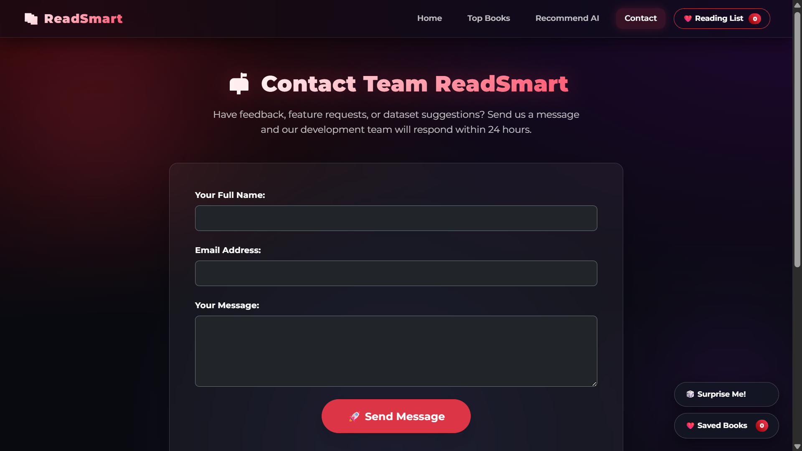

# 📚 ReadSmart — AI-Powered Book Recommender

A sleek **book discovery platform** using **Flask** and **Collaborative Filtering** to suggest personalized recommendations. Find your next favorite book in seconds.

> **Note:** This project uses pre-trained ML models. Clone and run locally with provided instructions.

---

## 🚀 Live Demo

**[🌍 Visit ReadSmart Live](https://readsmart-ai-omega.vercel.app/)**

*Experience the app instantly without any setup required!*

---

## ✨ Key Features

| Feature | Description |
|---------|-------------|
| 🎯 **Popular Books** | Trending books with ratings & reviews |
| 🤖 **Smart Recommendations** | Top 5 personalized book suggestions |
| 🔍 **Auto-Complete Search** | Real-time search suggestions |
| 📧 **Contact Form** | Direct user feedback system |
| 🎨 **Responsive UI** | Clean, modern interface |

---

## 🛠 Tech Stack

```
Backend:     Python • Flask • NumPy • Pickle
Frontend:    HTML5 • CSS3 • JavaScript • Jinja2
ML Engine:   Collaborative Filtering • Similarity Matrix
```

---

## 📂 Project Structure

```
ReadSmart/
├── app.py                      # Flask app
├── popular.pkl / pt.pkl / books.pkl / similarity_scores.pkl
├── templates/
│   ├── index.html
│   ├── recommend.html
│   └── contact.html
├── static/
│   ├── css/style.css
│   └── js/suggest.js
└── requirements.txt
```

---

## ⚙️ Quick Setup

### Prerequisites
```bash
Python 3.8+  •  pip  •  Git
```

### Installation

```bash
# Clone repo
git clone https://github.com/Partho-Kumar-Shaw/ReadSmart---A-Book-Recommender.git
cd ReadSmart---A-Book-Recommender

# Virtual environment (optional)
python -m venv venv
source venv/bin/activate  # Windows: venv\Scripts\activate

# Install dependencies
pip install -r requirements.txt

# Run application
python app.py
```

**Visit:** `http://127.0.0.1:5000/`

---

## 🌐 Application Routes

| Route | Purpose |
|-------|---------|
| `/` | Homepage - Popular Books |
| `/recommend` | Search & Get Recommendations |
| `/contact` | Feedback Form |
| `/suggest` | Auto-Complete API |

---

## 🧠 How It Works

1. **User Input** → Selects a book
2. **ML Engine** → Searches similarity matrix
3. **Ranking** → Sorts by relevance score
4. **Output** → Displays top 5 recommendations

**Algorithm:** Collaborative Filtering with precomputed similarity scores

---

## 📸 Screenshots

### 🏡 Home Page


--- 
### 👌Recommend Page


---

### 📞 Contact Page



---

## 🚀 Future Roadmap

- [ ] User authentication & profiles
- [ ] Save favorite books
- [ ] Database integration (PostgreSQL)
- [ ] REST API
- [ ] Genre filtering
- [ ] Cloud deployment
- [ ] Enhanced recommendation accuracy

---

## 🤝 Contributing

1. Fork the repository
2. Create feature branch: `git checkout -b feature-name`
3. Commit: `git commit -m "Description"`
4. Push: `git push origin feature-name`
5. Open Pull Request

---

## ❓ Troubleshooting

| Issue | Solution |
|-------|----------|
| `ModuleNotFoundError` | Run `pip install -r requirements.txt` |
| `PKL files missing` | Ensure all `.pkl` files in root directory |
| `Port 5000 in use` | Run `flask run --port=5001` |

---

## 📄 License

MIT License - Feel free to use and modify

---

## 👨‍💻 Author

**Partho Kumar Shaw**  
🔗 [GitHub](https://github.com/Partho-Kumar-Shaw)

---

## ⭐ Support This Project

- Star ⭐ the repository
- Fork & contribute
- Share feedback
- Help improve ReadSmart!

**ReadSmart — Discover Your Next Favorite Book 📖**
